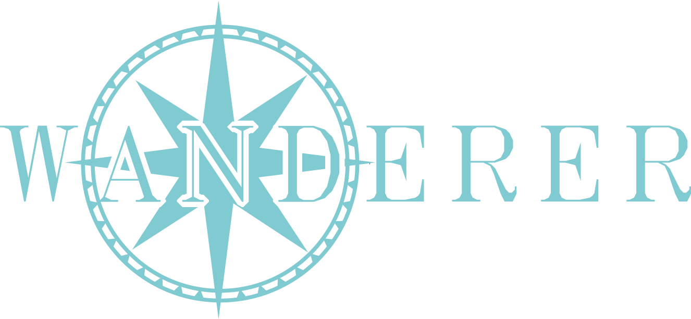
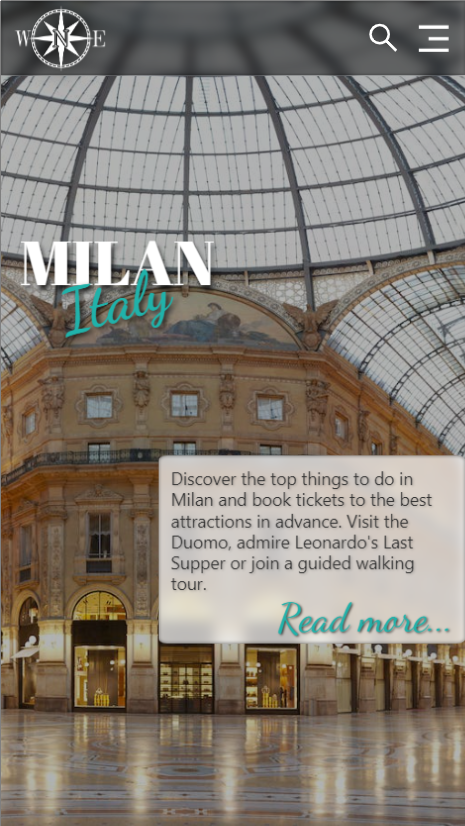
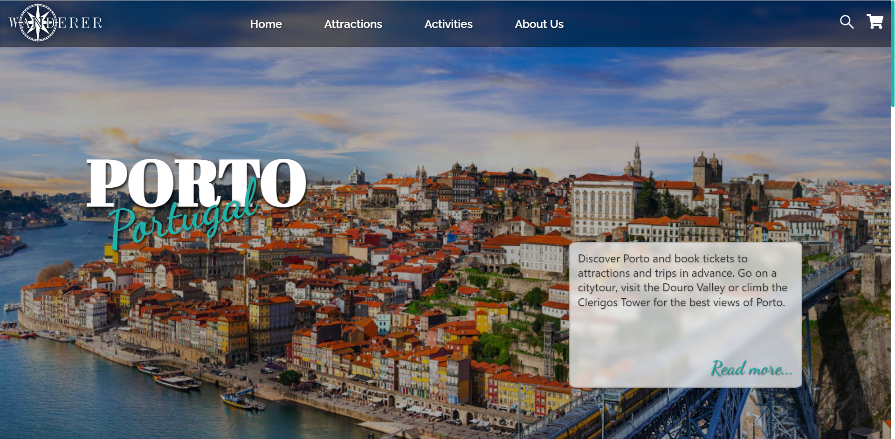
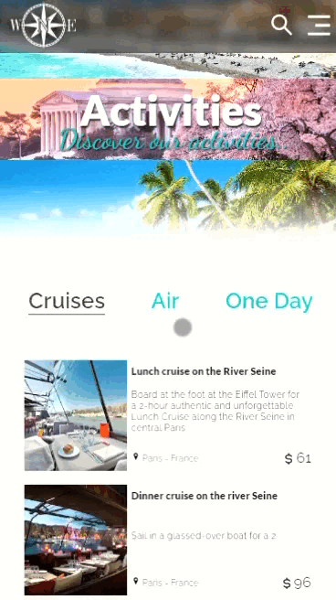
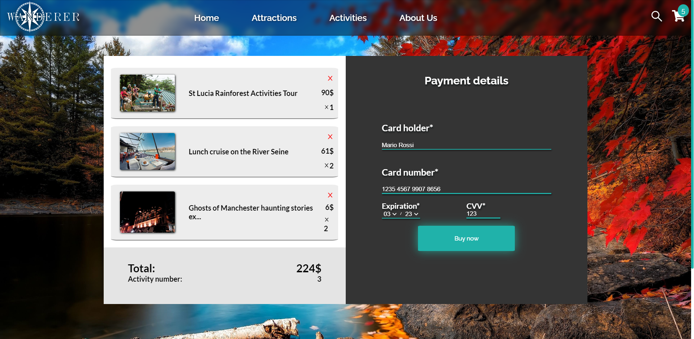

<body
  >
    

      <h1  align="center" >~Wanderer~</h1>
      <h2 align="center">Let your dreams come true</h2>
      

      
      

      

        Ciao a tutti! Siamo il team D e questo è il nostro progetto finale ❤️
      

      

      

        <h3>Description</h3>
        
Wenderer è una web App basata su l'API di <a style='color: lightseagreen; text-decoration: none'href='https://partner-api.musement.com/' target='_blank' >Musement</a> e sviluppata con React, con un design pensata da zero.  
          É progettata in modo che sia responsive, così che l'utente possa usufruirne 
          sia in modalità Desktop sia nei dispositivi mobile.
        

        

          <h4>Home in versione mobile e desktop</h4>
          

          
          
        

      

      

      <h3>Routing</h3>
      
In Wanderer puoi navigare da una pagina a un'altra grazie all'utilizzo di React-router-dom. 
      Inoltre puoi effettuare una ricerca per nome della città attraverso la Search Bar e visitare la pagina con le varie informazioni e attività. 

      

    <h3>Feature</h3>
  
Altra feature interessante è il carrello che richede l'autenticazione dell'utente in fase di acquisto e mostra le quantità selezionate, con possibilità di rimuoverle. 

  

  

    

    

    

      <h3>Tecnologie</h3>
      <ul style="list-style-type: none; padding: 0px;">
        <li>HTML</li>
        <li>SASS</li>
        <li>JAVASCRIPT</li>
        <li>REACT</li>
      </ul>
    

    

    

        <h3>Librerie</h3>
        <ul style="list-style-type: none; padding: 0px;">
          <li>CSS Modules</li>
          <li>React-router-dom</li>
          <li>Mui Core</li>
          <li>Hero slider</li>
          <li>React icons</li>
          <li>Mapbox-gl</li>
          <li>React-Redux</li>
          <li>Redux</li>
        </ul>
      

   
 
  

   

   

      <h3>Team D - coding bootcamp 4 Edgemony</h3>
      <ul style="list-style-type: none; padding: 0px;">
        <li>Roberta Rizzuto: <a style='color:lightseagreen; text-decoration: none;' href='https://www.linkedin.com/in/roberta-rizzuto/' target="_blank">Linkedin</a></li>
        <li>Federica Schillaci: 
          <a style='color:lightseagreen; text-decoration: none;' href='https://www.linkedin.com/in/federica-schillaci/' target="_blank">Linkedin</a></li>
        <li>Martina Li Vigni: <a style='color:lightseagreen; text-decoration: none;'
          href='https://www.linkedin.com/in/martina-li-vigni-lv/'
           target="_blank">Linkedin</a></li>
        <li>Marco Viscuso: <a style='color:lightseagreen; text-decoration: none;' 
          href='https://www.linkedin.com/in/marco-viscuso/' target="_blank">Linkedin</a></li>
        <li>Lorena Marullo: <a style='color:lightseagreen; text-decoration: none;' 
          href='https://www.linkedin.com/in/lorena-marullo-4
          43072138/' target="_blank">Linkedin</a></li>
      </ul>
    

    <cite>07/10/22</cite>
  </body>
